# Project on testing automation of the site [LITRES](https://www.litres.ru/)


## The checklist
### UI

  - Authorization in the desktop version of the site
  - The search on the site 
  - The product search filter 
  - Go through the book catalog 
  - View the description of the book 
  - Add the book to your favorites - a bug has been found
  - Add the book to your cart

### API
  - Аuthorization on the site
  - Put the book in the cart
  - Add a book to favorites
  - Perform a book search 

### Mobile
  - Log in to the app
  - Perform an in-app search
  - To search for a book in the application by an authorized user and put it in the trash

## Technologies and tools

<p align="center">


</br>


</p>

## Running tests
#### All UI tests are run remotely on Selenoid
### Locally:
1) Clone the [repository](https://github.com/AlexD120/Litres_shop.git)
2) Open the project in PyCharm
3) Enter the command in the terminal  

```python
python -m venv .venv
source .venv/bin/activate
pip install -r requirements.txt
pytest .
```
### Remote:
##  Jenkins

1) To run tests, go to [Jenkins](https://jenkins.autotests.cloud/job/Davydov_litres_shop_/) job and Click 'Build with parameters'

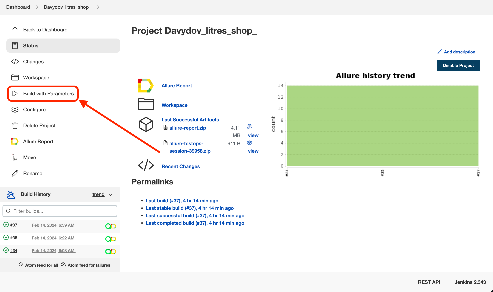

2) Select the necessary parameters and run 'Build'
* To launch, we have the following options:
  - [x] UI tests
  - [x] API tests
  - [x] Mobile tests
  - [x] All tests

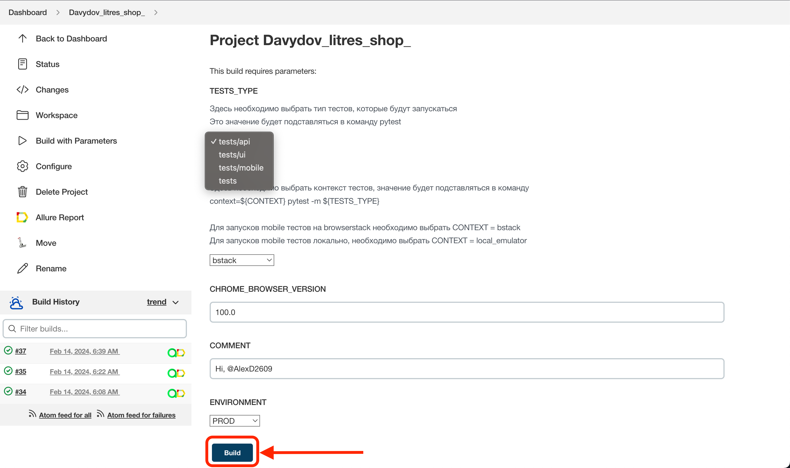


##  Allure

> *Allure Framework is an easy and flexible multi-language test report tool that not only shows a very concise representation of what have been tested in a neat web report form, but it also gives each team member a possibility to extract maximum of useful information from tests execution.*

### There are several ways to run the report, [here](https://jenkins.autotests.cloud/job/Davydov_litres_shop_/allure/) are some of them:
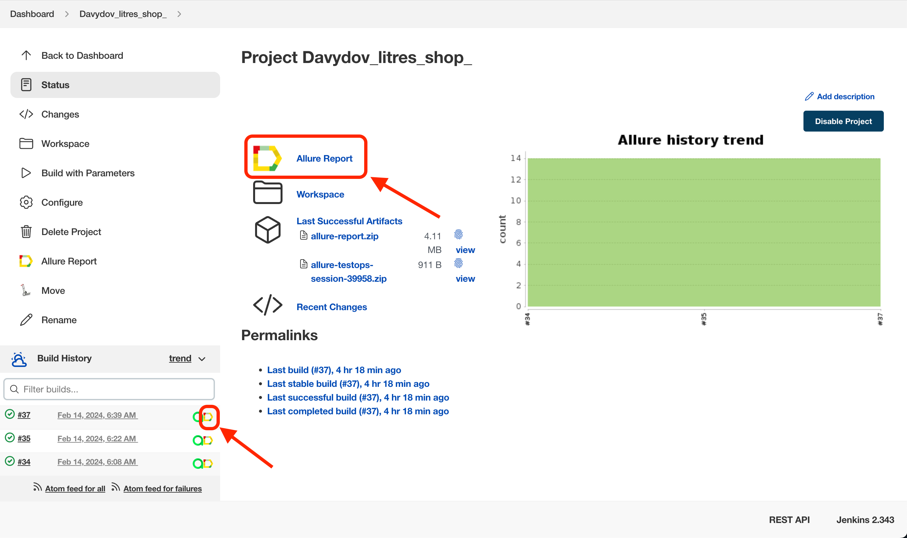

### Overview:
*Graphs, metrics, and statistics let you to analyze test results*

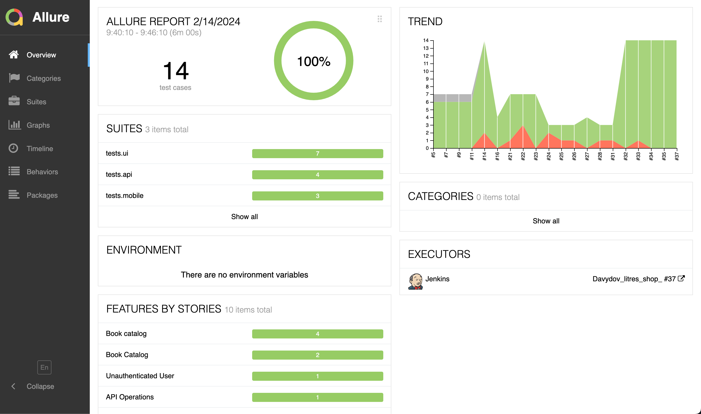

### Suites:
1) *And also the detailed result of the tests is displayed*
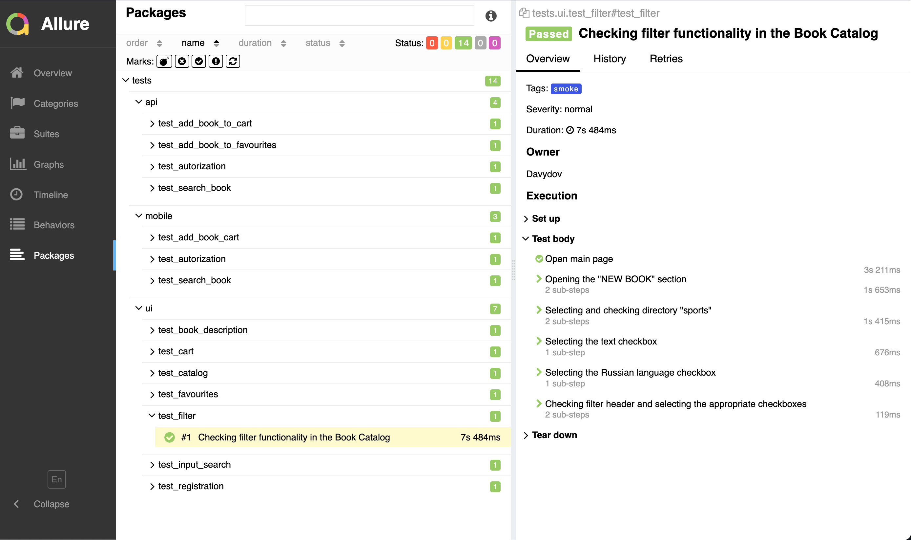


2) *For more clarity, a screenshot of the test result is available to you*
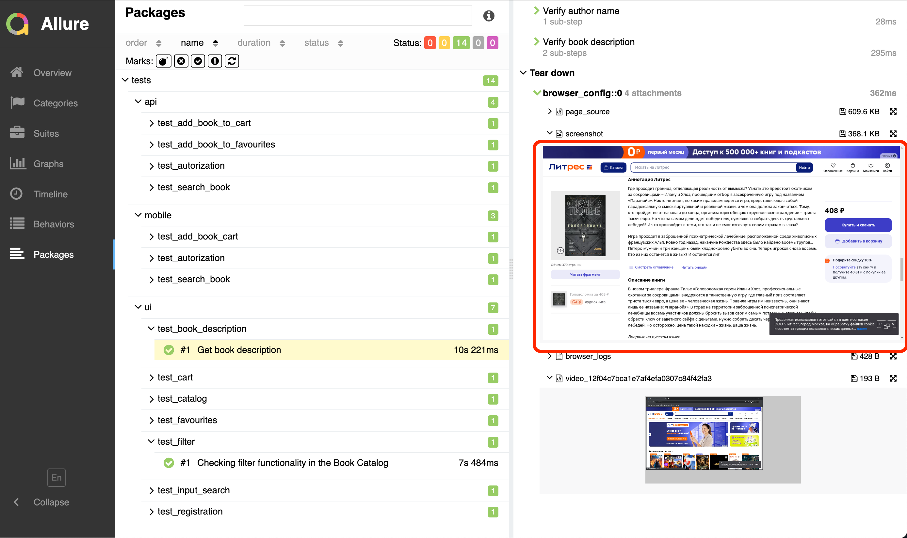


3) *Video recording of the Web autotest*


4) *And also, a video recording of the passage of mobile autotests through BrowserStack * 


##  Allure Testops
> *It is a Test management System (TMS) that allows you to manage both manual and automated testing. It is focused on automation and DevOps, and provides centralized management of tests, reporting and analytics.*

### There are several ways to run allure testOps, for example by clicking [here](https://allure.autotests.cloud/project/3973/dashboards)
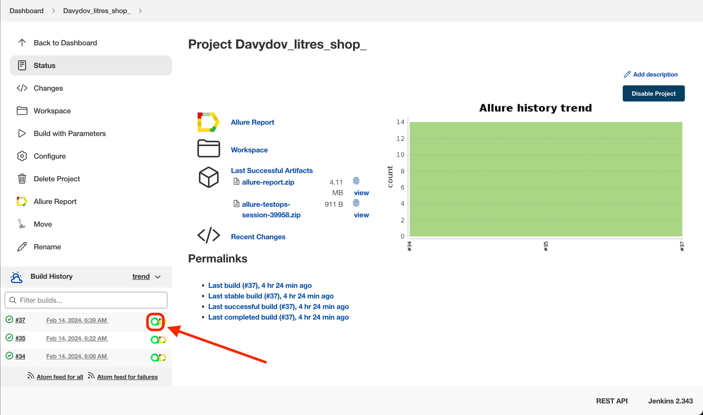

### Dashboard:
 *Dashboard with the test cases statuses on Allure TestOps:*
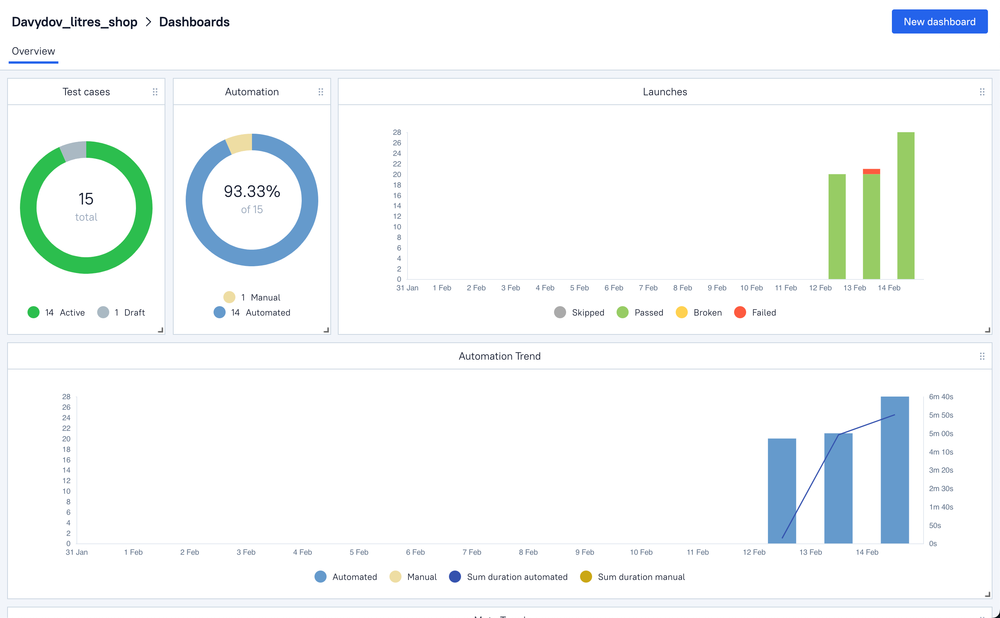

### Test Cases:
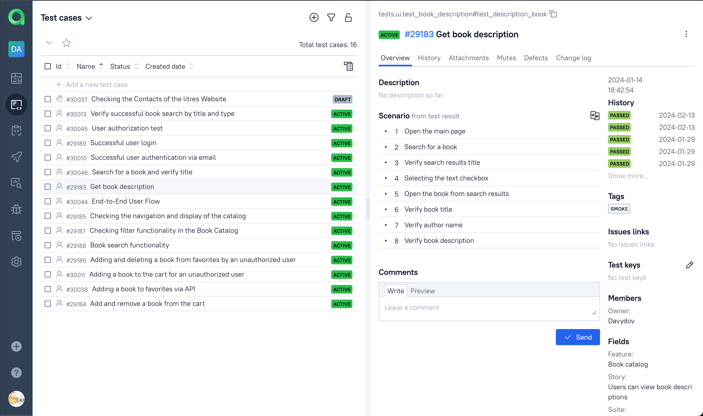

##  Jira
> *It is a project management and bug tracking system*

### All tests integrated with Jira to check statuses and activity
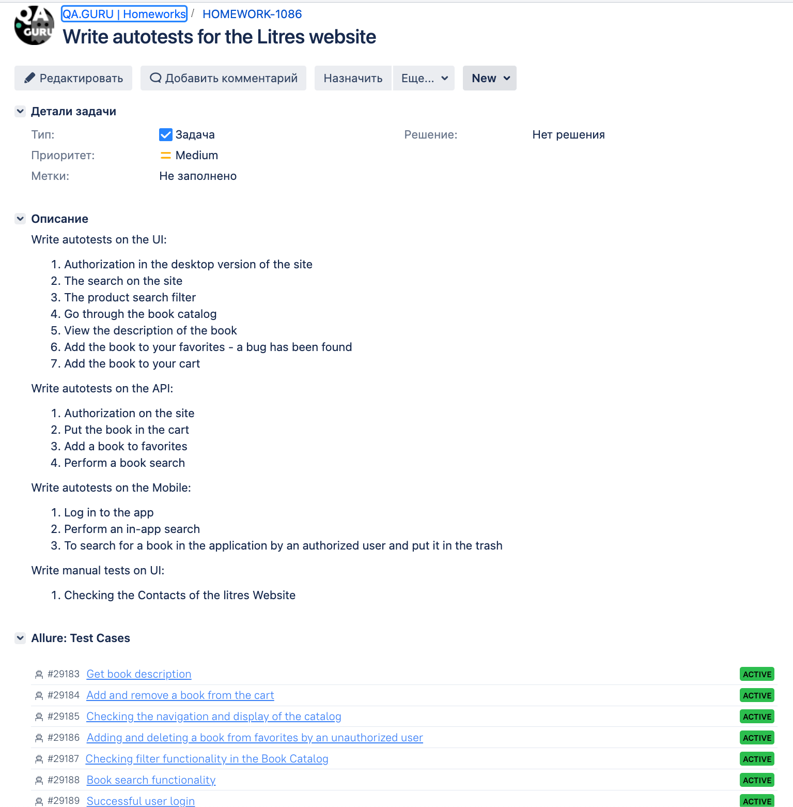


##  Telegram notification
> *Test results notifications to be sent to the specific telegram channel by the telegram bot*

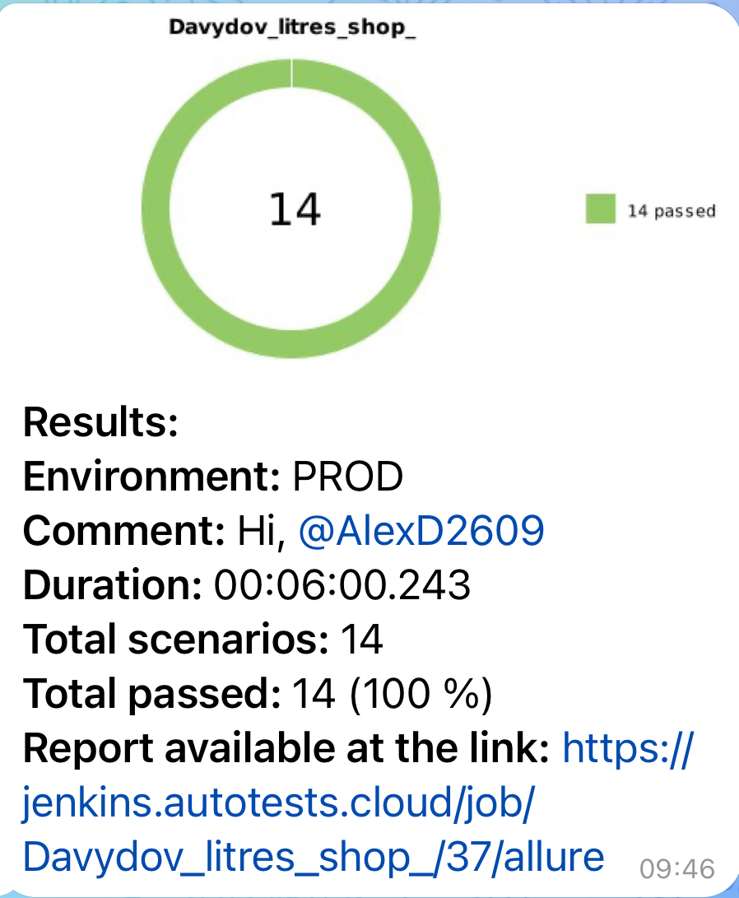

